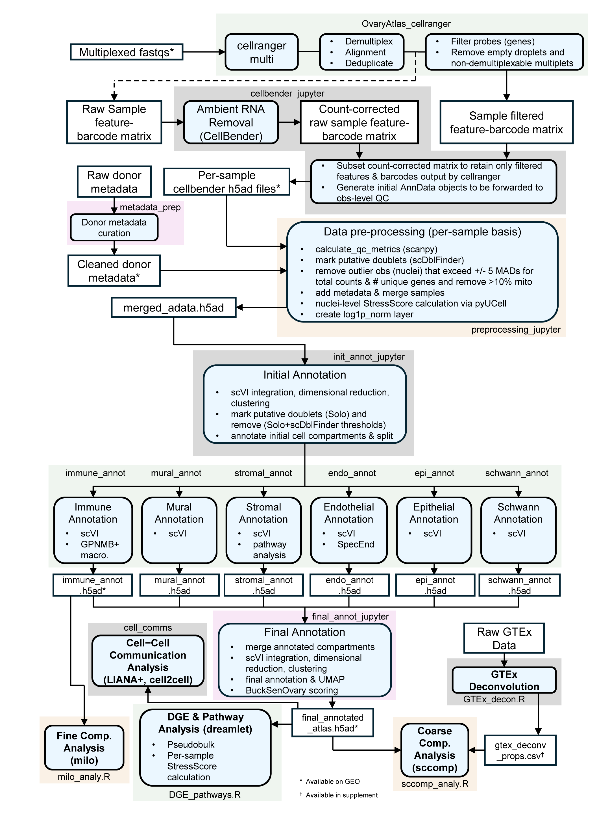

# snucRNA-seq Postmenopausal Human Ovary Aging Atlas

Code associated with a single-nucleus RNA-seq atlas of the aging postmenopausal human ovary.

## Overview

This repository contains scripts and notebooks used to process 10x Genomics Flex snucRNA-seq data, curate donor/sample metadata, perform cell type annotation, and run downstream analyses including pseudobulk differential expression, GTEx ovary bulk RNA-seq deconvolution, compositional modeling, Milo neighborhood-level differential abundance analysis, and cell-cell communication analysis.

The scripts are numbered to reflect the approximate order of the analysis workflow.

## Bioinformatic pipeline

## Repository contents

### 1. Preprocessing

- **1a_OvaryAtlas_cellranger.sh**  
  Runs Cell Ranger multi for multiplexed 10x Flex libraries and collects filtered per-sample count matrices.

- **1a_cellranger_multi_configs/**  
  Cell Ranger multi configuration CSV files used by `1a_OvaryAtlas_cellranger.sh` for each multiplexed plex.

- **1b_cellbender_jupyter.ipynb**  
  Runs CellBender-based ambient RNA correction and prepares corrected sample-level matrices for downstream preprocessing.

- **1c_metadata_prep.ipynb**  
  Curates donor and sample metadata for downstream integration and analysis.

- **1d_preprocessing_jupyter.ipynb**  
  Performs per-sample preprocessing, quality-control filtering, doublet annotation, metadata integration, StressScore scoring per nuclei, and merging into a combined AnnData object.

### 2. Cell type annotation

- **2a_init_annot_jupyter.ipynb**  
  Performs initial atlas-wide integration, clustering, doublet review/removal, and broad compartment annotation.

- **2b_immune_annot.ipynb**  
  Subclusters and annotates immune cell populations.

- **2c_mural_annot.ipynb**  
  Subclusters and annotates mural (smooth muscle, pericyte) populations.

- **2d_stromal_annot.ipynb**  
  Subclusters and annotates stromal populations and includes stromal pathway analyses.

- **2e_endo_annot.ipynb**  
  Subclusters and annotates endothelial populations.

- **2f_epi_annot.ipynb**  
  Subclusters and annotates epithelial populations.

- **2g_schwann_annot.ipynb**  
  Subclusters and annotates Schwann cell populations.

- **2h_final_annot_jupyter.ipynb**  
  Merges annotated compartments, performs final integration/visualization, scores for BuckSenOvary and generates the final annotated atlas object.

### 3. Downstream analyses

- **3a_DGE_pathways.R**  
  Performs cell type-level pseudobulk differential gene expression analysis and pathway enrichment analysis.

- **3b_GTEx_decon.R**  
  Performs GTEx ovary bulk RNA-seq deconvolution using the ovary snucRNA-seq reference augmented with an erythrocyte reference.

- **3c_sccomp_analy.R**  
  Runs coarse cell type compositional analysis on snucRNA-seq and GTEx-deconvolved bulk RNA-seq data using sccomp.

- **3d_milo_analy.R**  
  Runs Milo neighborhood-level differential abundance analysis in the immune compartment and downstream macrophage neighborhood analyses.

- **3e_cell_comms.ipynb**  
  Performs cell-cell communication analysis using LIANA+ and Tensor-cell2cell.

### 4. Helper and reference-preparation scripts

- **4a_utils_OvaryAtlas.py**  
  Python utility functions used across annotation and analysis notebooks.

- **4b_tabula_sapiens_erythrocyte_reference_prep.ipynb**  
  Prepares a Tabula Sapiens-derived erythrocyte-enriched reference used for GTEx deconvolution.

- **4c_sccomp_outlier_plot_helpers.R**  
  Helper functions for plotting sccomp model results with censored outlier sample-by-cell-type pairs shown explicitly.

## Software notes

Analyses were run using Python and R workflows. Major tools and packages used across the repository include Cell Ranger, CellBender, Scanpy, scVI-tools, CellTypist, dreamlet, miloR, sccomp, LIANA+, and Tensor-cell2cell.

Individual scripts and notebooks include additional package and session information where relevant.

## Data availability

The raw and processed data reported in this study have been deposited to the Gene Expression Omnibus (GEO) repository under accession number GSE329417. Additional supplementary files are described in the accompanying manuscript/preprint.

## Citation

If you use this code, please cite the accompanying manuscript/preprint:

Byrne et al. Single-nucleus profiling reveals age-associated remodeling opposed by parity in the postmenopausal human ovary, bioRxiv, 2026.
